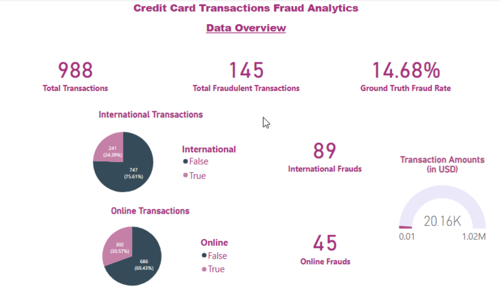
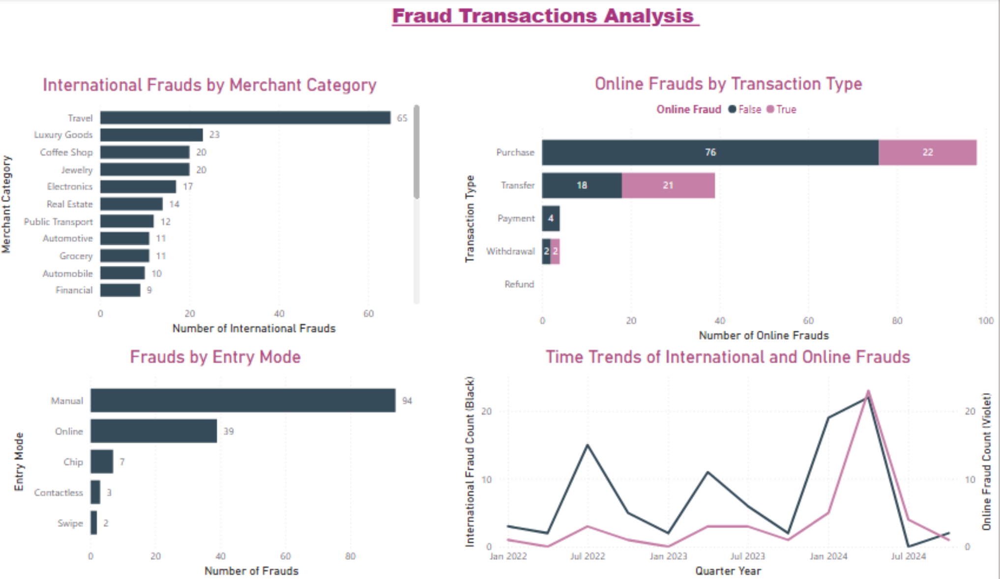
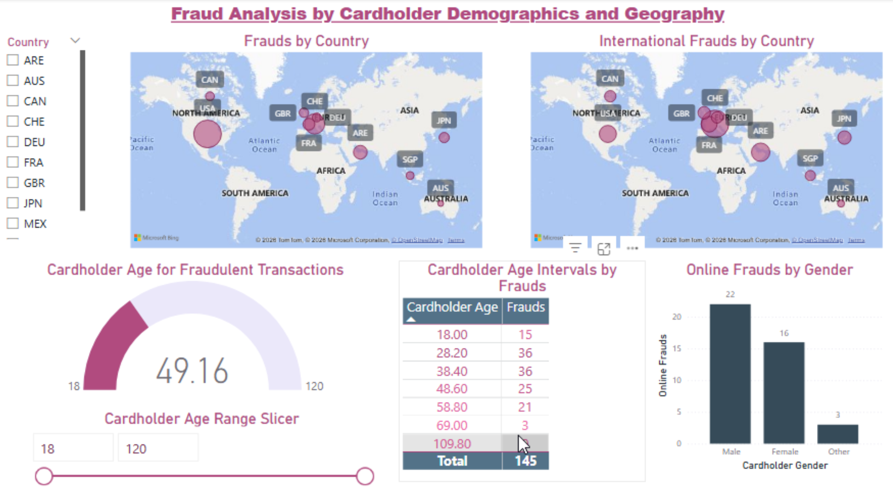
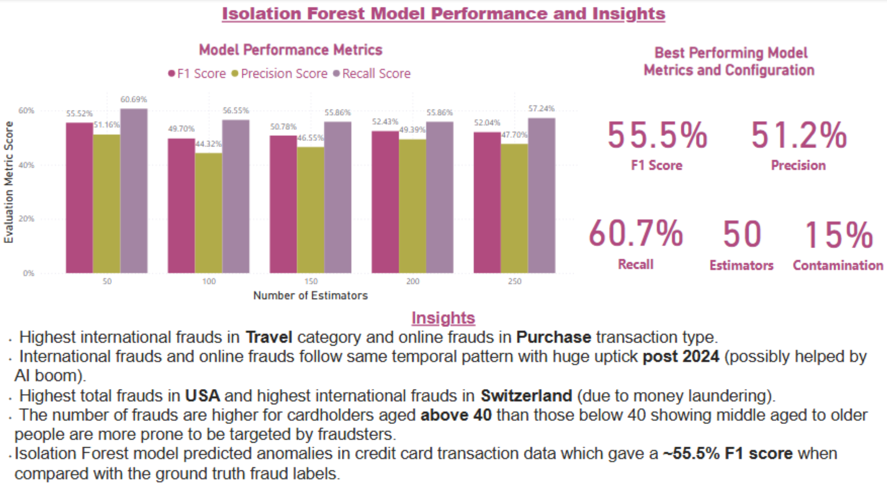

# Credit Card Fraud Data Analytics Project
## Introduction
Welcome to the Github repository of an end-to-end data analytics project simulating a real-world fraud detection pipeline which involves the following workflow:
- Procurement of Dataset 
- Augmenting Dataset 
- Data cleaning 
- Data transformation 
- Exploratory data analysis
- Data Modeling 
- Data Validation
- Data Automation
- Dashboarding

Thus, it covers all the steps in the Data Analytics lifecycle process from a raw unprocessed dataset to final cleaned data with appended model outputs and reporting through visualizations and extracted insights.

## Tech Stack

- **Data Source**: Open-source credit card transaction dataset (with fraud labels)
- **Data Storage**: AWS S3
- **Query Layer**: AWS Athena (SQL)
- **Processing/Feature Engineering**: Python (pandas, numpy, seaborn, scikit-learn)
- **Clustering**: K-Means
- **Anomaly Detection**: Isolation Forest (unsupervised model) trained with multiple combinations of dataset sizes and number of estimators for optimal performance.
- **Validation**: PyTest for pipeline unit testing
- **Automation**: AWS Glue ETL, AWS Cloudwatch
- **Dashboarding**: Power BI

## Project Scope

Focus                         | Key Activities |
------------------------------|----------------|
Data Acquisition              | Download & upload dataset to AWS S3 |
SQL Exploration               | Query with AWS Athena |
Data Cleaning                 | Handle nulls, duplicates, types |
Feature Engineering & EDA     | Derive features, compute correlation |
Clustering                    | K-Means on scaled features |
Outlier Detection             | Isolation Forest to detect frauds |
Pipeline Automation & Testing | Modular scripts + Glue ETL + PyTest |
Dashboard                     | Power BI with KPIs and visuals |

## Project Structure

├── dashboard/ # Power BI.pbix file and screenshots

├── data/ # Raw and processed CSVs

├── scripts/ # Python scripts for cleaning, transformation, clustering, modeling

├── tests/ # PyTest validation scripts

└── README.md

## Final Dashboard (Power BI)

> **Interactive Tableau Public Dashboard (Full Screen View)**: [Tableau Dashboard](https://public.tableau.com/views/Data_project_1/CreditCardDataOverview?:language=en-US&publish=yes&:sid=&:redirect=auth&:display_count=n&:origin=viz_share_link)

## Data Source

- [Credit Card Fraud Detection – GoMask](https://gomask.ai/marketplace/datasets/credit-card-fraud-patterns)

## Author
- Amartya Sharma | [LinkedIn](https://www.linkedin.com/in/amartya-sharma-svc/)

